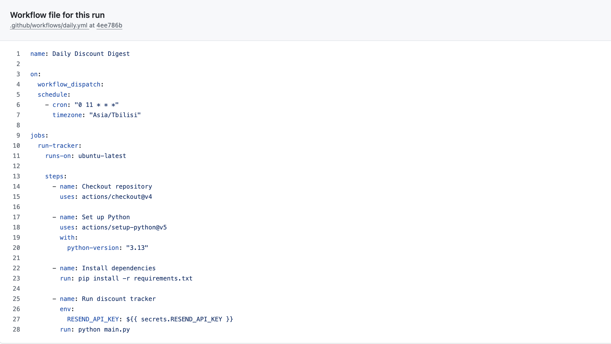

# daily-discount-tracker
# Daily Discount Tracker

An automated Python pipeline that collects discounted products from Morrison Shoes, groups product variants, generates a daily discount digest, and sends it to Gmail.

## Project Overview

The goal of this project is to practice building an automated data pipeline from end to end:

**Website → Data collection → Data processing → Digest generation → Email notification → Scheduled GitHub Actions workflow**

The pipeline runs automatically every day at **11:00 AM Tbilisi time**.

## How It Works

1. Fetches product data from the Morrison Shoes product API.
2. Identifies products where the current price is lower than the original price.
3. Calculates the discount percentage.
4. Groups different variants/sizes belonging to the same product.
5. Generates a readable daily discount digest.
6. Sends the digest through the Resend email API.
7. GitHub Actions runs the entire process automatically on a daily schedule.

## Technologies

* **Python 3.13**
* **Requests** — retrieving product data
* **Resend API** — sending email notifications
* **python-dotenv** — managing local environment variables
* **Git & GitHub**
* **GitHub Actions** — scheduled automation

## Project Structure

```text
daily-discount-tracker/
│
├── .github/
│   └── workflows/
│       └── daily.yml
│
├── main.py
├── requirements.txt
├── README.md
└── .gitignore
```

## Example Digest

```text
For The Music Black Tee
19.00 (was 39.00) | 51% off
Sizes: S, M, L, XL
Link: https://morrisonshoes.com/en/products/for-the-music-black-tee

Toledo
69.00 (was 89.00) | 22% off
Sizes: 36, 37, 38, 39, 40, 41, 42, 43, 44, 45, 46
Link: https://morrisonshoes.com/en/products/toledo
```

## Automation

The workflow is defined in:

```text
.github/workflows/daily.yml
```

It runs:

* **Manually** using GitHub Actions `workflow_dispatch`
* **Automatically** every day at 11:00 AM using the `Asia/Tbilisi` timezone

The Resend API key is stored securely as a **GitHub Actions repository secret** rather than being included in the source code.
## Successful GitHub Actions Run

The pipeline was tested successfully using GitHub Actions.




## What I Practiced

This project was built as a hands-on exercise in:

* Working with JSON APIs
* Writing Python data-processing logic
* Handling environment variables and secrets
* Building an automated pipeline
* Using Git and GitHub
* Creating scheduled GitHub Actions workflows
* Connecting an external API to an automated process
* Debugging the workflow from GitHub Actions logs
